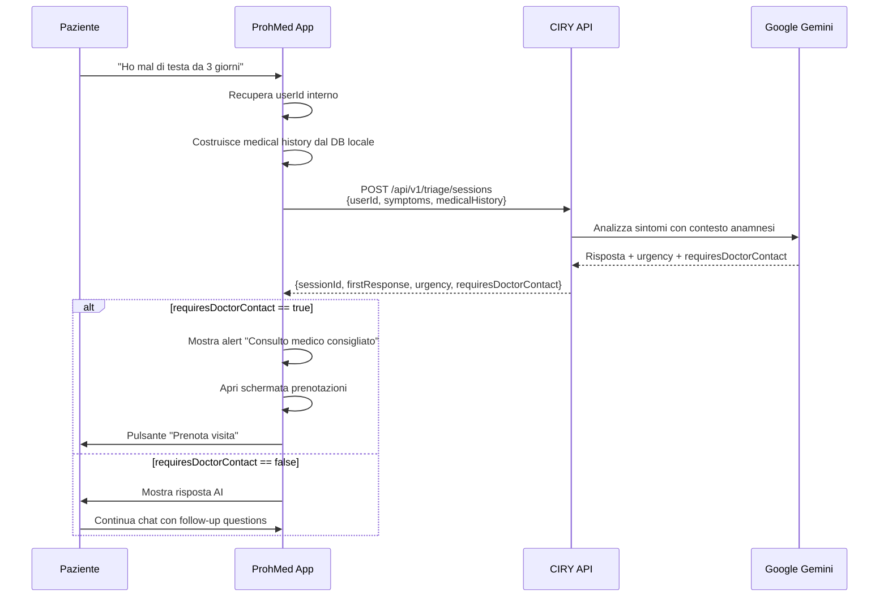

# 🩺 CIRY Triage API - Documentazione Tecnica per Sviluppatori ProhMed

**Versione API**: 1.0  
**Data**: 2 Novembre 2025  
**Target**: Sviluppatori ProhMed (Android/iOS)  
**Base URL Produzione**: `https://ciry.app`

---

## 📋 Indice

1. [Panoramica Architettura](#1-panoramica-architettura)
2. [Autenticazione e Sicurezza](#2-autenticazione-e-sicurezza)
3. [Riferimento API Completo](#3-riferimento-api-completo)
4. [Strutture Dati](#4-strutture-dati)
5. [Error Handling](#5-error-handling)
6. [Integrazione Client](#6-integrazione-client)
7. [Testing](#7-testing)
8. [Best Practices](#8-best-practices)
9. [FAQ e Troubleshooting](#9-faq-e-troubleshooting)

---

## 1. Panoramica Architettura

### 1.1 Principio di Responsabilità

```
┌─────────────────────────────────────────────────────────────┐
│                    APP PROHMED (Client)                      │
│  • Anagrafica pazienti (MASTER)                             │
│  • Cartella clinica completa (MASTER)                       │
│  • File referti medici (PDF, immagini) (MASTER)             │
│  • Sistema prenotazioni/appuntamenti (MASTER)               │
│  • UI/UX per booking medico                                 │
└────────────────────┬────────────────────────────────────────┘
                     │
                     │ REST API over HTTPS
                     │ Authentication: X-API-Key header
                     │
                     ↓
┌─────────────────────────────────────────────────────────────┐
│                  CIRY API (https://ciry.app)                │
│  • AI-powered medical triage (Google Gemini)               │
│  • Sessioni triage associate a userId ProhMed              │
│  • Chat conversazionale con contesto medico                │
│  • Valutazione urgenza (EMERGENCY/HIGH/MEDIUM/LOW)         │
│  • Flag requiresDoctorContact per routing automatico       │
│  • Snapshot anamnesi per contesto AI (non sincronizzato)   │
└─────────────────────────────────────────────────────────────┘
```

### 1.2 Separazione dei Dati

| Dato | Master | Nota |
|------|--------|------|
| Anagrafica paziente | ProhMed | Nome, cognome, data nascita, contatti |
| Cartella clinica | ProhMed | Allergie, patologie croniche, farmaci, interventi |
| File referti | ProhMed | PDF, immagini, documenti medici |
| Prenotazioni | ProhMed | Appuntamenti, calendario medici |
| Sessioni triage | CIRY | Conversazioni AI, symptom assessment |
| Messaggi chat | CIRY | Storico domande/risposte triage |
| Snapshot anamnesi | CIRY | Copia puntuale al momento del triage (non aggiornata) |

**IMPORTANTE**: CIRY **NON** riceve file. Solo dati testuali strutturati (JSON) per contesto AI.

### 1.3 Flusso Tipico



---

## 2. Autenticazione e Sicurezza

### 2.1 API Key

**Formato**: `ciry_` + 43 caratteri base64url (256-bit entropy)

**Esempio**:
```
ciry_Ldv1ZgklZhJq9AERbZfuf0ic-14U1-DTLYNmwBq4tuM
```

### 2.2 Configurazione Client

**Variabili di ambiente** (esempio per React Native `.env`):

```bash
CIRY_API_URL=https://ciry.app
CIRY_API_KEY=ciry_Ldv1ZgklZhJq9AERbZfuf0ic-14U1-DTLYNmwBq4tuM
```

**IMPORTANTE**: 
- ⚠️ Non committare mai l'API key su Git
- ⚠️ Usare `.env` file con `.gitignore`
- ⚠️ Per Android: `BuildConfig` con `buildConfigField`
- ⚠️ Per iOS: `Info.plist` con configurazioni per environment

### 2.3 Headers Richiesta

Ogni richiesta HTTP deve includere:

```http
POST /api/v1/triage/sessions HTTP/1.1
Host: ciry.app
Content-Type: application/json
X-API-Key: ciry_Ldv1ZgklZhJq9AERbZfuf0ic-14U1-DTLYNmwBq4tuM

{...body...}
```

### 2.4 Rate Limiting

**Limite default**: 120 richieste/minuto per API key

**Headers risposta**:
```http
X-RateLimit-Limit: 120
X-RateLimit-Remaining: 115
X-RateLimit-Reset: 2025-11-02T22:45:00.000Z
```

**Risposta quando limite superato**:
```http
HTTP/1.1 429 Too Many Requests
Retry-After: 42

{
  "error": "Rate limit exceeded",
  "retryAfter": 42
}
```

**Implementazione retry**:
```typescript
async function apiRequestWithRetry(url: string, options: RequestInit, maxRetries = 3) {
  for (let attempt = 0; attempt < maxRetries; attempt++) {
    const response = await fetch(url, options);
    
    if (response.status === 429) {
      const retryAfter = parseInt(response.headers.get('Retry-After') || '60');
      console.log(`Rate limited. Retrying after ${retryAfter}s...`);
      await new Promise(resolve => setTimeout(resolve, retryAfter * 1000));
      continue;
    }
    
    return response;
  }
  throw new Error('Max retries exceeded');
}
```

### 2.5 Sicurezza

- ✅ **HTTPS obbligatorio**: Tutte le richieste su TLS 1.2+
- ✅ **API Key in header**: Mai in URL o query params
- ✅ **No CORS dal browser**: API progettata per mobile app native
- ✅ **SHA-256 hashing**: API key hashate server-side
- ✅ **Scopes**: Permessi granulari (`triage:read`, `triage:write`)

---

## 3. Riferimento API Completo

### 3.1 Documentazione API

**Endpoint**: `GET /api/v1/docs`

Restituisce specifica completa API in formato JSON.

```bash
curl https://ciry.app/api/v1/docs
```

---

### 3.2 Creare Sessione Triage

**Endpoint**: `POST /api/v1/triage/sessions`

Crea una nuova sessione di triage per un paziente.

#### Request

**Headers**:
```http
Content-Type: application/json
X-API-Key: ciry_Ldv1ZgklZhJq9AERbZfuf0ic-14U1-DTLYNmwBq4tuM
```

**Body**:
```json
{
  "userId": "prohmed_user_12345",
  "initialSymptoms": "Mal di testa persistente da 3 giorni, nausea, sensibilità alla luce",
  "medicalHistory": {
    "age": 35,
    "gender": "female",
    "chronicConditions": ["emicrania", "ansia"],
    "currentMedications": ["sumatriptan 50mg al bisogno", "sertralina 50mg/die"],
    "allergies": ["penicillina", "lattosio"],
    "pastSurgeries": ["appendicectomia 2018"]
  }
}
```

**Parametri**:

| Campo | Tipo | Obbligatorio | Descrizione |
|-------|------|--------------|-------------|
| `userId` | `string` | ✅ Sì | Identificativo univoco paziente su ProhMed |
| `initialSymptoms` | `string` | ✅ Sì | Descrizione iniziale sintomi (min 10 char) |
| `medicalHistory` | `object` | ❌ No | Anamnesi paziente (opzionale ma consigliato) |
| `medicalHistory.age` | `number` | ❌ No | Età paziente |
| `medicalHistory.gender` | `"male" \| "female" \| "other"` | ❌ No | Sesso biologico |
| `medicalHistory.chronicConditions` | `string[]` | ❌ No | Patologie croniche (es: diabete, ipertensione) |
| `medicalHistory.currentMedications` | `string[]` | ❌ No | Farmaci assunti attualmente |
| `medicalHistory.allergies` | `string[]` | ❌ No | Allergie note (farmaci, alimenti) |
| `medicalHistory.pastSurgeries` | `string[]` | ❌ No | Interventi chirurgici pregressi |

#### Response Success (201)

```json
{
  "sessionId": "c2e50230-6d37-4c99-8e8e-6118fb21221c",
  "userId": "prohmed_user_12345",
  "status": "active",
  "createdAt": "2025-11-02T22:24:08.986Z",
  "firstResponse": {
    "role": "assistant",
    "content": "Comprendo la tua preoccupazione per questo mal di testa persistente. Considerando la tua storia di emicrania e i sintomi descritti (nausea, fotofobia), potrebbe trattarsi di un episodio emicranico. Hai già provato il sumatriptan come prescritto? Quando hai avuto l'ultimo episodio simile?",
    "urgency": "medium",
    "requiresDoctorContact": false
  }
}
```

**Campi risposta**:

| Campo | Tipo | Descrizione |
|-------|------|-------------|
| `sessionId` | `string` | UUID della sessione (usare per successive interazioni) |
| `userId` | `string` | Echo del userId fornito |
| `status` | `"active"` | Stato sessione (sempre "active" alla creazione) |
| `createdAt` | `string` | Timestamp ISO 8601 |
| `firstResponse.role` | `"assistant"` | Ruolo messaggio (sempre "assistant") |
| `firstResponse.content` | `string` | Risposta testuale AI |
| `firstResponse.urgency` | `"low" \| "medium" \| "high" \| "emergency"` | Livello urgenza valutato da AI |
| `firstResponse.requiresDoctorContact` | `boolean` | `true` = AI raccomanda consulto medico urgente |

#### Livelli di Urgenza

| Valore | Significato | Azione suggerita |
|--------|-------------|------------------|
| `emergency` | Emergenza medica | Chiamare 118 / Andare in PS immediatamente |
| `high` | Sintomi gravi | Consultare medico entro 24h |
| `medium` | Sintomi moderati | Consultare medico entro 3-7 giorni |
| `low` | Sintomi lievi | Monitorare, consultare se peggiora |

#### Flag requiresDoctorContact

**Quando è `true`**:
- AI raccomanda fortemente consulto medico professionale
- App ProhMed dovrebbe:
  1. Mostrare alert visibile "Consulto medico consigliato"
  2. Offrire pulsante "Prenota visita" prominente
  3. (Opzionale) Aprire automaticamente schermata booking

**Esempio implementazione**:
```typescript
const response = await createTriageSession(userId, symptoms, medicalHistory);

if (response.firstResponse.requiresDoctorContact) {
  // Mostra alert
  Alert.alert(
    'Consulto Medico Consigliato',
    'In base ai sintomi descritti, ti raccomandiamo di consultare un medico. Vuoi prenotare una visita?',
    [
      { text: 'Prenota Ora', onPress: () => navigation.navigate('Booking') },
      { text: 'Continua Chat', style: 'cancel' }
    ]
  );
}
```

#### Error Responses

**400 Bad Request** - Parametri invalidi:
```json
{
  "error": "Validation error",
  "details": "userId is required and must be a non-empty string"
}
```

**401 Unauthorized** - API Key mancante o invalida:
```json
{
  "error": "Unauthorized",
  "message": "Invalid or missing API key"
}
```

**403 Forbidden** - API Key senza permessi necessari:
```json
{
  "error": "Forbidden",
  "message": "API key does not have required scope: triage:write"
}
```

**429 Too Many Requests** - Rate limit superato:
```json
{
  "error": "Rate limit exceeded",
  "retryAfter": 42
}
```

**500 Internal Server Error** - Errore server:
```json
{
  "error": "Internal server error",
  "message": "AI service temporarily unavailable"
}
```

---

### 3.3 Inviare Messaggio a Sessione Esistente

**Endpoint**: `POST /api/v1/triage/sessions/:sessionId/messages`

Continua la conversazione in una sessione attiva.

#### Request

**URL**: `/api/v1/triage/sessions/c2e50230-6d37-4c99-8e8e-6118fb21221c/messages`

**Body**:
```json
{
  "message": "Sì, ho preso il sumatriptan 2 ore fa ma il dolore persiste. Il mal di testa è più forte del solito."
}
```

**Parametri**:

| Campo | Tipo | Obbligatorio | Descrizione |
|-------|------|--------------|-------------|
| `message` | `string` | ✅ Sì | Messaggio/domanda paziente (min 1 char) |

#### Response Success (200)

```json
{
  "role": "assistant",
  "content": "Capisco la tua preoccupazione. Se il sumatriptan non ha dato sollievo dopo 2 ore e il dolore è più intenso del normale, potrebbe essere necessaria una valutazione medica. Hai altri sintomi nuovi come febbre, rigidità nucale, o problemi di vista?",
  "urgency": "high",
  "requiresDoctorContact": true
}
```

#### Error Responses

**404 Not Found** - Sessione non trovata:
```json
{
  "error": "Session not found",
  "sessionId": "c2e50230-6d37-4c99-8e8e-6118fb21221c"
}
```

---

### 3.4 Recuperare Storico Messaggi

**Endpoint**: `GET /api/v1/triage/sessions/:sessionId/messages`

Ottiene tutti i messaggi di una sessione.

#### Request

**URL**: `/api/v1/triage/sessions/c2e50230-6d37-4c99-8e8e-6118fb21221c/messages`

#### Response Success (200)

```json
{
  "sessionId": "c2e50230-6d37-4c99-8e8e-6118fb21221c",
  "messages": [
    {
      "id": "msg_001",
      "role": "user",
      "content": "Mal di testa persistente da 3 giorni, nausea, sensibilità alla luce",
      "timestamp": "2025-11-02T22:24:08.986Z"
    },
    {
      "id": "msg_002",
      "role": "assistant",
      "content": "Comprendo la tua preoccupazione...",
      "timestamp": "2025-11-02T22:24:12.153Z",
      "urgency": "medium",
      "requiresDoctorContact": false
    },
    {
      "id": "msg_003",
      "role": "user",
      "content": "Sì, ho preso il sumatriptan 2 ore fa...",
      "timestamp": "2025-11-02T22:30:45.221Z"
    },
    {
      "id": "msg_004",
      "role": "assistant",
      "content": "Capisco la tua preoccupazione...",
      "timestamp": "2025-11-02T22:30:48.887Z",
      "urgency": "high",
      "requiresDoctorContact": true
    }
  ]
}
```

---

### 3.5 Recuperare Sessioni Paziente

**Endpoint**: `GET /api/v1/triage/sessions?userId={userId}`

Ottiene tutte le sessioni di un paziente.

#### Request

**URL**: `/api/v1/triage/sessions?userId=prohmed_user_12345`

**Query Parameters**:

| Parametro | Tipo | Obbligatorio | Descrizione |
|-----------|------|--------------|-------------|
| `userId` | `string` | ✅ Sì | ID utente ProhMed |
| `status` | `"active" \| "closed"` | ❌ No | Filtra per stato sessione |
| `limit` | `number` | ❌ No | Max risultati (default: 50) |
| `offset` | `number` | ❌ No | Offset paginazione (default: 0) |

#### Response Success (200)

```json
{
  "userId": "prohmed_user_12345",
  "sessions": [
    {
      "sessionId": "c2e50230-6d37-4c99-8e8e-6118fb21221c",
      "status": "active",
      "createdAt": "2025-11-02T22:24:08.986Z",
      "lastMessageAt": "2025-11-02T22:30:48.887Z",
      "messageCount": 4,
      "latestUrgency": "high"
    },
    {
      "sessionId": "a1b2c3d4-e5f6-7890-abcd-ef1234567890",
      "status": "closed",
      "createdAt": "2025-10-28T14:15:22.000Z",
      "lastMessageAt": "2025-10-28T14:45:30.123Z",
      "messageCount": 8,
      "latestUrgency": "low"
    }
  ],
  "total": 2
}
```

---

### 3.6 Recuperare Dettagli Sessione

**Endpoint**: `GET /api/v1/triage/sessions/:sessionId`

Ottiene dettagli completi di una sessione.

#### Request

**URL**: `/api/v1/triage/sessions/c2e50230-6d37-4c99-8e8e-6118fb21221c`

#### Response Success (200)

```json
{
  "sessionId": "c2e50230-6d37-4c99-8e8e-6118fb21221c",
  "userId": "prohmed_user_12345",
  "status": "active",
  "createdAt": "2025-11-02T22:24:08.986Z",
  "lastMessageAt": "2025-11-02T22:30:48.887Z",
  "initialSymptoms": "Mal di testa persistente da 3 giorni, nausea, sensibilità alla luce",
  "medicalHistory": {
    "age": 35,
    "gender": "female",
    "chronicConditions": ["emicrania", "ansia"],
    "currentMedications": ["sumatriptan 50mg", "sertralina 50mg"],
    "allergies": ["penicillina", "lattosio"]
  },
  "messageCount": 4,
  "latestUrgency": "high",
  "requiresDoctorContact": true
}
```

---

### 3.7 Chiudere Sessione

**Endpoint**: `DELETE /api/v1/triage/sessions/:sessionId`

Chiude una sessione attiva (stato diventa "closed").

#### Request

**URL**: `/api/v1/triage/sessions/c2e50230-6d37-4c99-8e8e-6118fb21221c`

#### Response Success (200)

```json
{
  "sessionId": "c2e50230-6d37-4c99-8e8e-6118fb21221c",
  "status": "closed",
  "closedAt": "2025-11-02T23:15:00.000Z"
}
```

**Nota**: Sessioni chiuse rimangono nel database per storico, ma non accettano nuovi messaggi.

---

## 4. Strutture Dati

### 4.1 Medical History Object

Schema TypeScript:

```typescript
interface MedicalHistory {
  age?: number;                    // Età paziente (0-150)
  gender?: 'male' | 'female' | 'other';  // Sesso biologico
  chronicConditions?: string[];    // Es: ["diabete tipo 2", "ipertensione"]
  currentMedications?: string[];   // Es: ["metformina 1000mg", "ramipril 10mg"]
  allergies?: string[];            // Es: ["penicillina", "lattosio", "pollini"]
  pastSurgeries?: string[];        // Es: ["appendicectomia 2018", "colecistectomia 2020"]
}
```

**Validazione**:
- Tutti i campi sono opzionali
- `age`: numero tra 0 e 150
- `gender`: enum `"male" | "female" | "other"`
- Array: possono essere vuoti `[]`

**Best Practices**:
- Più informazioni fornite = risposte AI più personalizzate
- Includere sempre `age` e `gender` se disponibili
- Elencare allergie note per evitare raccomandazioni pericolose
- Farmaci: includere dosaggio se disponibile (es: "metformina 1000mg" invece di "metformina")

### 4.2 Message Object

```typescript
interface Message {
  id: string;                      // UUID messaggio
  role: 'user' | 'assistant';      // Ruolo mittente
  content: string;                 // Testo messaggio
  timestamp: string;               // ISO 8601 timestamp
  urgency?: 'low' | 'medium' | 'high' | 'emergency';  // Solo per assistant
  requiresDoctorContact?: boolean; // Solo per assistant
}
```

### 4.3 Session Object

```typescript
interface TriageSession {
  sessionId: string;               // UUID sessione
  userId: string;                  // ID paziente su ProhMed
  status: 'active' | 'closed';     // Stato sessione
  createdAt: string;               // ISO 8601
  lastMessageAt: string;           // ISO 8601
  initialSymptoms: string;         // Sintomi iniziali
  medicalHistory?: MedicalHistory; // Snapshot anamnesi
  messageCount: number;            // Numero messaggi totali
  latestUrgency: 'low' | 'medium' | 'high' | 'emergency';
  requiresDoctorContact: boolean;  // Flag ultimo messaggio
}
```

---

## 5. Error Handling

### 5.1 Codici HTTP

| Codice | Significato | Azione Client |
|--------|-------------|---------------|
| `200` | OK | Processa risposta |
| `201` | Created | Salva sessionId |
| `400` | Bad Request | Valida parametri, mostra errore utente |
| `401` | Unauthorized | Verifica API key, contatta admin |
| `403` | Forbidden | API key senza permessi, contatta admin |
| `404` | Not Found | Sessione/risorsa non esiste |
| `429` | Too Many Requests | Implementa retry con backoff |
| `500` | Internal Server Error | Mostra errore generico, retry |
| `503` | Service Unavailable | AI temporaneamente offline, retry |

### 5.2 Formato Errori

Tutti gli errori seguono questo schema:

```typescript
interface ApiError {
  error: string;        // Tipo errore machine-readable
  message?: string;     // Messaggio human-readable
  details?: string;     // Dettagli tecnici (solo in dev/staging)
  retryAfter?: number;  // Secondi da attendere (solo 429)
}
```

**Esempio**:
```json
{
  "error": "Validation error",
  "message": "Invalid medical history format",
  "details": "Field 'age' must be a number between 0 and 150"
}
```

### 5.3 Implementazione Error Handling

```typescript
async function createTriageSession(
  userId: string,
  symptoms: string,
  medicalHistory?: MedicalHistory
): Promise<TriageSession> {
  try {
    const response = await fetch('https://ciry.app/api/v1/triage/sessions', {
      method: 'POST',
      headers: {
        'Content-Type': 'application/json',
        'X-API-Key': CIRY_API_KEY,
      },
      body: JSON.stringify({
        userId,
        initialSymptoms: symptoms,
        medicalHistory,
      }),
    });

    // Rate limiting
    if (response.status === 429) {
      const retryAfter = parseInt(response.headers.get('Retry-After') || '60');
      throw new RateLimitError(`Rate limited. Retry after ${retryAfter}s`, retryAfter);
    }

    // Errori client (4xx)
    if (response.status >= 400 && response.status < 500) {
      const error = await response.json();
      throw new ClientError(error.message || error.error, response.status);
    }

    // Errori server (5xx)
    if (response.status >= 500) {
      throw new ServerError('CIRY service temporarily unavailable', response.status);
    }

    return await response.json();
  } catch (error) {
    if (error instanceof RateLimitError) {
      // Implementa retry automatico o mostra timer utente
      console.log(`Retry after ${error.retryAfter}s`);
      throw error;
    }
    
    if (error instanceof ClientError) {
      // Errore parametri - mostra messaggio utente
      Alert.alert('Errore', error.message);
      throw error;
    }
    
    if (error instanceof ServerError) {
      // Errore server - mostra messaggio generico
      Alert.alert('Servizio Temporaneamente Non Disponibile', 'Riprova tra qualche minuto');
      throw error;
    }
    
    // Errore rete o altro
    Alert.alert('Errore di Connessione', 'Verifica la tua connessione internet');
    throw error;
  }
}
```

---

## 6. Integrazione Client

### 6.1 React Native con TypeScript

**Installazione dipendenze**:
```bash
npm install @react-native-async-storage/async-storage
npm install react-native-dotenv
```

**`.env` file**:
```bash
CIRY_API_URL=https://ciry.app
CIRY_API_KEY=ciry_Ldv1ZgklZhJq9AERbZfuf0ic-14U1-DTLYNmwBq4tuM
```

**`services/CiryAPI.ts`**:

```typescript
import { CIRY_API_URL, CIRY_API_KEY } from '@env';

export interface MedicalHistory {
  age?: number;
  gender?: 'male' | 'female' | 'other';
  chronicConditions?: string[];
  currentMedications?: string[];
  allergies?: string[];
  pastSurgeries?: string[];
}

export interface TriageSession {
  sessionId: string;
  userId: string;
  status: 'active' | 'closed';
  createdAt: string;
  firstResponse: {
    role: 'assistant';
    content: string;
    urgency: 'low' | 'medium' | 'high' | 'emergency';
    requiresDoctorContact: boolean;
  };
}

export interface Message {
  id: string;
  role: 'user' | 'assistant';
  content: string;
  timestamp: string;
  urgency?: 'low' | 'medium' | 'high' | 'emergency';
  requiresDoctorContact?: boolean;
}

class CiryAPI {
  private baseURL: string;
  private apiKey: string;

  constructor() {
    this.baseURL = CIRY_API_URL;
    this.apiKey = CIRY_API_KEY;
  }

  private async request<T>(
    endpoint: string,
    options: RequestInit = {}
  ): Promise<T> {
    const url = `${this.baseURL}${endpoint}`;
    const headers = {
      'Content-Type': 'application/json',
      'X-API-Key': this.apiKey,
      ...options.headers,
    };

    const response = await fetch(url, { ...options, headers });

    if (!response.ok) {
      const error = await response.json().catch(() => ({}));
      throw new Error(error.message || `HTTP ${response.status}`);
    }

    return response.json();
  }

  async createSession(
    userId: string,
    symptoms: string,
    medicalHistory?: MedicalHistory
  ): Promise<TriageSession> {
    return this.request<TriageSession>('/api/v1/triage/sessions', {
      method: 'POST',
      body: JSON.stringify({
        userId,
        initialSymptoms: symptoms,
        medicalHistory,
      }),
    });
  }

  async sendMessage(sessionId: string, message: string): Promise<Message> {
    return this.request<Message>(
      `/api/v1/triage/sessions/${sessionId}/messages`,
      {
        method: 'POST',
        body: JSON.stringify({ message }),
      }
    );
  }

  async getMessages(sessionId: string): Promise<{ messages: Message[] }> {
    return this.request<{ messages: Message[] }>(
      `/api/v1/triage/sessions/${sessionId}/messages`
    );
  }

  async getSessions(userId: string): Promise<{ sessions: TriageSession[] }> {
    return this.request<{ sessions: TriageSession[] }>(
      `/api/v1/triage/sessions?userId=${userId}`
    );
  }

  async closeSession(sessionId: string): Promise<void> {
    await this.request(`/api/v1/triage/sessions/${sessionId}`, {
      method: 'DELETE',
    });
  }
}

export default new CiryAPI();
```

**Esempio schermata React Native**:

```tsx
import React, { useState } from 'react';
import { View, Text, TextInput, Button, Alert } from 'react-native';
import CiryAPI from './services/CiryAPI';

export default function TriageScreen({ userId }: { userId: string }) {
  const [symptoms, setSymptoms] = useState('');
  const [loading, setLoading] = useState(false);

  const startTriage = async () => {
    if (symptoms.length < 10) {
      Alert.alert('Errore', 'Descrivi i sintomi in modo più dettagliato');
      return;
    }

    setLoading(true);
    try {
      // Recupera medical history dal tuo DB locale
      const medicalHistory = await fetchUserMedicalHistory(userId);

      const session = await CiryAPI.createSession(
        userId,
        symptoms,
        medicalHistory
      );

      // Controlla flag doctor contact
      if (session.firstResponse.requiresDoctorContact) {
        Alert.alert(
          'Consulto Medico Consigliato',
          'In base ai sintomi, ti consigliamo di consultare un medico. Vuoi prenotare?',
          [
            {
              text: 'Prenota Ora',
              onPress: () => navigation.navigate('Booking'),
            },
            {
              text: 'Continua Chat',
              onPress: () =>
                navigation.navigate('TriageChat', {
                  sessionId: session.sessionId,
                }),
            },
          ]
        );
      } else {
        navigation.navigate('TriageChat', {
          sessionId: session.sessionId,
        });
      }
    } catch (error) {
      Alert.alert('Errore', error.message);
    } finally {
      setLoading(false);
    }
  };

  return (
    <View>
      <Text>Descrivi i tuoi sintomi:</Text>
      <TextInput
        multiline
        value={symptoms}
        onChangeText={setSymptoms}
        placeholder="Es: Mal di testa da 3 giorni, nausea..."
      />
      <Button
        title={loading ? 'Analisi in corso...' : 'Inizia Triage'}
        onPress={startTriage}
        disabled={loading}
      />
    </View>
  );
}
```

---

### 6.2 Flutter con Dart

**`pubspec.yaml`**:
```yaml
dependencies:
  flutter:
    sdk: flutter
  http: ^1.1.0
  flutter_dotenv: ^5.1.0
```

**`.env` file**:
```bash
CIRY_API_URL=https://ciry.app
CIRY_API_KEY=ciry_Ldv1ZgklZhJq9AERbZfuf0ic-14U1-DTLYNmwBq4tuM
```

**`lib/services/ciry_api.dart`**:

```dart
import 'dart:convert';
import 'package:http/http.dart' as http;
import 'package:flutter_dotenv/flutter_dotenv.dart';

class MedicalHistory {
  final int? age;
  final String? gender;
  final List<String>? chronicConditions;
  final List<String>? currentMedications;
  final List<String>? allergies;
  final List<String>? pastSurgeries;

  MedicalHistory({
    this.age,
    this.gender,
    this.chronicConditions,
    this.currentMedications,
    this.allergies,
    this.pastSurgeries,
  });

  Map<String, dynamic> toJson() => {
        if (age != null) 'age': age,
        if (gender != null) 'gender': gender,
        if (chronicConditions != null) 'chronicConditions': chronicConditions,
        if (currentMedications != null) 'currentMedications': currentMedications,
        if (allergies != null) 'allergies': allergies,
        if (pastSurgeries != null) 'pastSurgeries': pastSurgeries,
      };
}

class TriageSession {
  final String sessionId;
  final String userId;
  final String status;
  final DateTime createdAt;
  final FirstResponse firstResponse;

  TriageSession({
    required this.sessionId,
    required this.userId,
    required this.status,
    required this.createdAt,
    required this.firstResponse,
  });

  factory TriageSession.fromJson(Map<String, dynamic> json) {
    return TriageSession(
      sessionId: json['sessionId'],
      userId: json['userId'],
      status: json['status'],
      createdAt: DateTime.parse(json['createdAt']),
      firstResponse: FirstResponse.fromJson(json['firstResponse']),
    );
  }
}

class FirstResponse {
  final String content;
  final String urgency;
  final bool requiresDoctorContact;

  FirstResponse({
    required this.content,
    required this.urgency,
    required this.requiresDoctorContact,
  });

  factory FirstResponse.fromJson(Map<String, dynamic> json) {
    return FirstResponse(
      content: json['content'],
      urgency: json['urgency'],
      requiresDoctorContact: json['requiresDoctorContact'],
    );
  }
}

class CiryAPI {
  final String baseUrl;
  final String apiKey;

  CiryAPI()
      : baseUrl = dotenv.env['CIRY_API_URL']!,
        apiKey = dotenv.env['CIRY_API_KEY']!;

  Future<TriageSession> createSession({
    required String userId,
    required String symptoms,
    MedicalHistory? medicalHistory,
  }) async {
    final response = await http.post(
      Uri.parse('$baseUrl/api/v1/triage/sessions'),
      headers: {
        'Content-Type': 'application/json',
        'X-API-Key': apiKey,
      },
      body: jsonEncode({
        'userId': userId,
        'initialSymptoms': symptoms,
        if (medicalHistory != null) 'medicalHistory': medicalHistory.toJson(),
      }),
    );

    if (response.statusCode == 201) {
      return TriageSession.fromJson(jsonDecode(response.body));
    } else {
      final error = jsonDecode(response.body);
      throw Exception(error['message'] ?? 'Errore sconosciuto');
    }
  }

  Future<Map<String, dynamic>> sendMessage({
    required String sessionId,
    required String message,
  }) async {
    final response = await http.post(
      Uri.parse('$baseUrl/api/v1/triage/sessions/$sessionId/messages'),
      headers: {
        'Content-Type': 'application/json',
        'X-API-Key': apiKey,
      },
      body: jsonEncode({'message': message}),
    );

    if (response.statusCode == 200) {
      return jsonDecode(response.body);
    } else {
      throw Exception('Errore invio messaggio');
    }
  }
}
```

**Esempio widget Flutter**:

```dart
import 'package:flutter/material.dart';
import 'services/ciry_api.dart';

class TriageScreen extends StatefulWidget {
  final String userId;
  const TriageScreen({required this.userId});

  @override
  _TriageScreenState createState() => _TriageScreenState();
}

class _TriageScreenState extends State<TriageScreen> {
  final _symptomsController = TextEditingController();
  final _api = CiryAPI();
  bool _loading = false;

  Future<void> _startTriage() async {
    if (_symptomsController.text.length < 10) {
      ScaffoldMessenger.of(context).showSnackBar(
        SnackBar(content: Text('Descrivi i sintomi in modo più dettagliato')),
      );
      return;
    }

    setState(() => _loading = true);

    try {
      // Recupera medical history dal DB locale
      final medicalHistory = await fetchUserMedicalHistory(widget.userId);

      final session = await _api.createSession(
        userId: widget.userId,
        symptoms: _symptomsController.text,
        medicalHistory: medicalHistory,
      );

      if (session.firstResponse.requiresDoctorContact) {
        showDialog(
          context: context,
          builder: (context) => AlertDialog(
            title: Text('Consulto Medico Consigliato'),
            content: Text(
                'In base ai sintomi, ti consigliamo di consultare un medico.'),
            actions: [
              TextButton(
                onPressed: () {
                  Navigator.pop(context);
                  Navigator.pushNamed(context, '/booking');
                },
                child: Text('Prenota Ora'),
              ),
              TextButton(
                onPressed: () {
                  Navigator.pop(context);
                  Navigator.pushNamed(
                    context,
                    '/triage-chat',
                    arguments: session.sessionId,
                  );
                },
                child: Text('Continua Chat'),
              ),
            ],
          ),
        );
      } else {
        Navigator.pushNamed(
          context,
          '/triage-chat',
          arguments: session.sessionId,
        );
      }
    } catch (e) {
      ScaffoldMessenger.of(context).showSnackBar(
        SnackBar(content: Text('Errore: ${e.toString()}')),
      );
    } finally {
      setState(() => _loading = false);
    }
  }

  @override
  Widget build(BuildContext context) {
    return Scaffold(
      appBar: AppBar(title: Text('Triage Sintomi')),
      body: Padding(
        padding: EdgeInsets.all(16),
        child: Column(
          children: [
            Text('Descrivi i tuoi sintomi:'),
            SizedBox(height: 8),
            TextField(
              controller: _symptomsController,
              maxLines: 5,
              decoration: InputDecoration(
                hintText: 'Es: Mal di testa da 3 giorni, nausea...',
                border: OutlineInputBorder(),
              ),
            ),
            SizedBox(height: 16),
            ElevatedButton(
              onPressed: _loading ? null : _startTriage,
              child: Text(_loading ? 'Analisi in corso...' : 'Inizia Triage'),
            ),
          ],
        ),
      ),
    );
  }
}
```

---

## 7. Testing

### 7.1 Test con cURL

**Test 1: Creare sessione base**:
```bash
curl -X POST 'https://ciry.app/api/v1/triage/sessions' \
  -H "X-API-Key: ciry_Ldv1ZgklZhJq9AERbZfuf0ic-14U1-DTLYNmwBq4tuM" \
  -H 'Content-Type: application/json' \
  -d '{
    "userId": "test_user_001",
    "initialSymptoms": "Febbre alta da 2 giorni, tosse secca"
  }'
```

**Test 2: Sessione con medical history completo**:
```bash
curl -X POST 'https://ciry.app/api/v1/triage/sessions' \
  -H "X-API-Key: ciry_Ldv1ZgklZhJq9AERbZfuf0ic-14U1-DTLYNmwBq4tuM" \
  -H 'Content-Type: application/json' \
  -d '{
    "userId": "test_user_002",
    "initialSymptoms": "Dolore toracico intenso, sudorazione fredda",
    "medicalHistory": {
      "age": 58,
      "gender": "male",
      "chronicConditions": ["ipertensione", "diabete tipo 2"],
      "currentMedications": ["ramipril 10mg", "metformina 1000mg"],
      "allergies": ["penicillina"]
    }
  }'
```

**Test 3: Inviare messaggio**:
```bash
# Prima salva sessionId dalla risposta precedente
SESSION_ID="c2e50230-6d37-4c99-8e8e-6118fb21221c"

curl -X POST "https://ciry.app/api/v1/triage/sessions/${SESSION_ID}/messages" \
  -H "X-API-Key: ciry_Ldv1ZgklZhJq9AERbZfuf0ic-14U1-DTLYNmwBq4tuM" \
  -H 'Content-Type: application/json' \
  -d '{
    "message": "Il dolore persiste anche dopo aver preso il farmaco"
  }'
```

**Test 4: Recuperare storico**:
```bash
curl -X GET "https://ciry.app/api/v1/triage/sessions/${SESSION_ID}/messages" \
  -H "X-API-Key: ciry_Ldv1ZgklZhJq9AERbZfuf0ic-14U1-DTLYNmwBq4tuM"
```

### 7.2 Test Automatico

Script bash completo disponibile: `test-prohmed-api.sh`

```bash
chmod +x test-prohmed-api.sh
export CIRY_API_KEY='ciry_Ldv1ZgklZhJq9AERbZfuf0ic-14U1-DTLYNmwBq4tuM'
./test-prohmed-api.sh
```

---

## 8. Best Practices

### 8.1 Medical History

✅ **DO**:
- Includere sempre `age` e `gender` se disponibili
- Elencare tutte le allergie note (farmaci E alimenti)
- Specificare dosaggio farmaci: `"metformina 1000mg/die"` invece di `"metformina"`
- Usare terminologia medica corretta: `"diabete mellito tipo 2"` invece di `"diabete"`
- Aggiornare medical history localmente su ProhMed, non su CIRY (è uno snapshot)

❌ **DON'T**:
- Non inviare array vuoti se non hai dati: ometti il campo
- Non includere dati sensibili non necessari (es: nome, cognome, indirizzo)
- Non aspettarti che CIRY sincronizzi medical history con ProhMed (è read-only snapshot)

### 8.2 Gestione Sessioni

✅ **DO**:
- Salvare `sessionId` localmente per permettere utente di riprendere chat
- Mostrare storico sessioni nella UI utente
- Chiudere esplicitamente sessioni quando utente ha finito (`DELETE /sessions/:id`)
- Gestire sessioni multiple per stesso utente (ogni sintomo = nuova sessione)

❌ **DON'T**:
- Non riusare stessa sessione per sintomi diversi (crea nuova sessione)
- Non lasciare troppe sessioni "active" aperte (chiudile quando risolte)

### 8.3 UX e Flag `requiresDoctorContact`

✅ **DO**:
- Mostrare alert visibile quando `requiresDoctorContact === true`
- Offrire pulsante "Prenota Visita" prominente
- Permettere comunque di continuare chat (non forzare booking)
- Usare colori appropriati per urgency (rosso=emergency, arancio=high, etc)

❌ **DON'T**:
- Non bloccare completamente l'app forzando booking
- Non ignorare il flag (potrebbe essere critico per salute paziente)

### 8.4 Sicurezza

✅ **DO**:
- Salvare API key in variabili ambiente/secrets management
- Usare HTTPS per tutte le richieste
- Validare input utente prima di inviare a CIRY
- Implementare timeout rete (30s consigliato)
- Loggare errori per debug ma MAI API keys

❌ **DON'T**:
- Non committare API key su Git/repository pubblici
- Non loggare request/response body in produzione (dati sensibili)
- Non bypassare validazione SSL/TLS

### 8.5 Performance

✅ **DO**:
- Cachare risposte localmente quando possibile
- Implementare retry con exponential backoff per errori 5xx
- Mostrare loading state durante chiamate API (possono richiedere 5-10s per AI)
- Usare paginazione per lista sessioni (`limit` e `offset`)

❌ **DON'T**:
- Non fare polling continuo - CIRY non supporta WebSocket/SSE (usa polling solo se necessario)
- Non fare richieste parallele eccessive (rispetta rate limit 120/min)

---

## 9. FAQ e Troubleshooting

### Q1: Posso modificare medical history dopo aver creato sessione?

**No**. Medical history è uno snapshot al momento della creazione. Se dati cambiano:
1. Aggiorna sul tuo DB ProhMed
2. Crea nuova sessione triage con dati aggiornati

---

### Q2: Quanto tempo rimangono salvate le sessioni su CIRY?

Permanentemente (o fino a cancellazione manuale). Sessioni chiuse non vengono auto-eliminate.

---

### Q3: Posso riutilizzare API key per test e produzione?

**Sconsigliato**. Chiedi admin CIRY di generare:
- Key di test per sviluppo/staging
- Key separata per produzione

---

### Q4: Cosa succede se AI non risponde (timeout)?

CIRY ha timeout di 60s per risposte AI. Se timeout:
- Ricevi errore 503 Service Unavailable
- Implementa retry dopo 5-10s
- Mostra messaggio utente: "AI temporaneamente non disponibile"

---

### Q5: requiresDoctorContact è sempre affidabile?

**No, è solo una raccomandazione AI**. Non sostituisce giudizio medico professionale. Usarlo come:
- Suggerimento per utente
- Trigger per facilitare booking
- Mai come diagnosi medica definitiva

---

### Q6: Posso inviare file referti (PDF/immagini) a CIRY?

**No**. CIRY accetta solo dati testuali JSON. File referti rimangono su ProhMed.

---

### Q7: API supporta multilingua?

Attualmente solo **Italiano**. AI risponde in italiano basandosi su training dati italiani.

---

### Q8: Come gestire pazienti senza medical history?

Invia solo `userId` e `initialSymptoms`. Ometti campo `medicalHistory` o invialo come `{}`. AI risponderà comunque ma senza personalizzazione.

---

### Q9: Rate limit 120 req/min è per API key o per utente?

**Per API key** (quindi condiviso tra tutti utenti ProhMed). Se insufficiente, contatta admin per aumento.

---

### Q10: Posso testare su ambiente staging?

Contatta admin CIRY per credenziali staging. Produzione usa sempre `https://ciry.app`.

---

## 10. Supporto Tecnico

### Contatti

- **Documentazione**: `PROHMED_INTEGRATION.md`, `TESTING_GUIDE.md`
- **Script Test**: `test-prohmed-api.sh`
- **Endpoint Docs**: `GET https://ciry.app/api/v1/docs`

### Richieste API Key

Contattare amministratore CIRY per:
- Generazione nuove API keys
- Modifica rate limits
- Cambio scopes/permessi
- Rotazione keys (sicurezza)

### Segnalazione Bug

Includere sempre:
1. Timestamp richiesta (ISO 8601)
2. Endpoint chiamato
3. Request body (rimuovere dati sensibili)
4. Response status + body
5. Ambiente (produzione/staging)
6. API key prefix (primi 12 char: `ciry_Ldv1Zgk...`)

---

## 11. Changelog

### v1.0 - 2 Novembre 2025
- ✅ Rilascio iniziale API v1
- ✅ Endpoint triage completi
- ✅ Supporto medical history
- ✅ Flag requiresDoctorContact
- ✅ Rate limiting 120 req/min
- ✅ Autenticazione API key

---

**Fine Documentazione** 🏁

Per domande tecniche o assistenza integrazione, contattare team CIRY.
